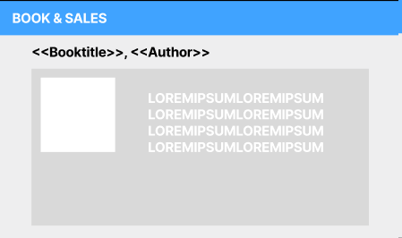

# Startdocument for Store

Startdocument of **Robin van Dijk**, student number **5018927** & **Chris Klunder**, student number **5051053**.

## Problem Description

For this class, we are planning on making an online bookstore where users can browse, search and purchase books. 

The application has to have at least three different design patterns. For this demand, we chose the following:

- For the payment of books and tracking the items in the payment cart of an user, we have decided to use the memento pattern;

- For creating different types of books like physical, online and audio books, we have decided to add the factory pattern to the application; 

- To implement a way for users to pay for books in different ways, the application will be using the strategy pattern.

## Requirements 

The requirements will be determined by using the MoSCoW-method. By using thie method, the group is able to analyse and prioritize the functions in the according manner.

### Must Have:

First of all, the **Must-Haves**. These are necessary to the product itself in order for it to function properly. 

### Should Have:

Secondly, the **Should-Haves**. These aren't necessary to the product, but still hold some importance.
The main focus being, that they **Should** have been in the product, but aren't essential to make the product work.

### Could Have:

The third would be **Could-Haves**. These aren't necessary nor essential. They would be nice to have in the product as an extra.

### Won't Have:

Lastly, the **Won`t -Haves**. These, as the name suggests, will not be in the product at all.

| Nr  | Function in question                                                          | "???" Have |
|-----|-------------------------------------------------------------------------------|------------|
| 1   | Being able to add a book                                                      | Must Have  |
| 2   | Being able to see an overview of all books                                    | Must Have  |
| 3   | Being able to choose different paying methods                                 | Must Have  |
| 4   | Being able to send automatic notifications about books arrivals or promotions | Must Have  |
| 5   | Being able to view the book in more detail (Like description and summary)     | Must Have  |
| 6   | The cart of the user has to be able to be retrieved on reopening the application   | Must Have  |
| 7   | A user should be able to register                                             | Should Have |
| 8   | A user should be able to login                                                | Should Have |
| 9   | A user should be able to logout                                               | Should Have |
| 10  | A user should be able to search a specific book                               | Should Have |
| 11  | A user should be able to filter by genre                                      | Should Have |
| 12  | A user should be able to purchase a book                                      | Should Have |
| 13  | Should be able to change a book                                               | Should Have |
| 14  | Should be able to delete a book                                               | Should Have |
| 15  | A user might be able to write a review                                        | Could Have |
| 16  | A user might be able to rate the book                                         | Could Have | 
| 17  | A user won't be able to make a book list | Won't Have |

___

#### Remarks

* Input will be validated.
* Only the Main class will contain `System.out.println`

___

## WireFrames

### Login

### Register

### Bookoverview

### Individual book

### Cart

---
## Class Diagram

